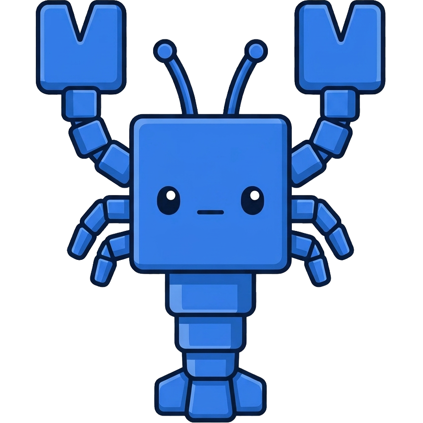

# kube-claw

**A Kubernetes operator that runs sandboxed, Slack-triggered AI agents — with a real secret-authority and human-approved, audited credential access.**

Mention the bot in a channel and it spins up a one-shot/warm pod running a Claude
tool-use loop, answers in-thread, stays warm for follow-ups, then scales to zero.
Agents only get a secret after a PAM-style approval (or self-service provisioning)
in Slack — credentials are encrypted at rest, bound to the agent + image, and the
value never enters the model's context or the logs.

> Inspired by [nano-claw](https://github.com/nanocoai/nanoclaw)'s container-per-agent
> idea, rebuilt as a Kubernetes-native control plane: one CRD, a pluggable store,
> a secret authority, and a self-hosted admin UI.

---

## Quickstart

**Prerequisites:** an authenticated `kubectl` pointed at any cluster, `helm`, and a
Slack app + Anthropic API key. No Docker build, no repo clone — the chart and images
are published to Docker Hub (`docker.io/bitwavecode/*`).

**One-liner** (interactive — prompts for tokens/keys, stores them as Kubernetes
Secrets, rolls out the control plane; no clone needed):

```bash
curl -fsSL https://kube-claw.com/install.sh | bash
```

**Helm-only install** (the chart is self-contained — CRDs included, signed
self-updates verified out of the box; every knob is a value):

```bash
kubectl create namespace claw-system && kubectl create namespace claw-agents
kubectl -n claw-system create secret generic claw-slack-tokens \
  --from-literal=app-token=xapp-... --from-literal=bot-token=xoxb-...
kubectl -n claw-agents create secret generic claw-anthropic-key \
  --from-literal=api-key=sk-ant-...
kubectl -n claw-system create secret generic claw-admin --from-literal=password=...

helm install claw oci://registry-1.docker.io/bitwavecode/claw \
  -n claw-system --set slack.enabled=true
```

Or clone the repo for the interactive script, which does all of the above with
prompts:

```bash
# Installs onto your CURRENT kubectl context.
# Prompts for: Slack tokens, the Anthropic key, an admin password, and an optional UI URL.
./scripts/install.sh
```

That's it. The script confirms the target context, applies the CRD, stores your
keys as Kubernetes Secrets (never in Helm values/history), and rolls out the
control plane. It prints the admin URL and password when done.

Or deploy non-interactively from a gitignored secrets file:

```bash
# .secrets.env  (never committed)
#   SLACK_APP_TOKEN=xapp-...
#   SLACK_BOT_TOKEN=xoxb-...
#   ANTHROPIC_API_KEY=sk-ant-...
#   ADMIN_PASSWORD=...          # optional; admin dashboard basic-auth
./scripts/deploy-secrets.sh
```

> Standing up a fresh **GKE Autopilot** cluster end-to-end (cluster, registry,
> images, HTTPS Ingress, secrets)? See **[`docs/deploy-gke.md`](docs/deploy-gke.md)**.

> Want to run a custom controller/runner or a new agent base image? See
> [Advanced: building a custom image](#advanced-building-a-custom-image).

### Slack app setup

Enable **Socket Mode** and create both tokens (app-level `xapp-` + bot `xoxb-`).

| Capability | Event subscription | Bot scope |
|---|---|---|
| `@mention` triggers a run | `app_mention` | — |
| Thread replies / channel messages (multi-turn) | `message.channels` (+`message.groups`) | — |
| Bot DMs you (secret links, replies) | — | `chat:write`, `im:write` |
| 👀 / 💤 reactions | — | `reactions:write` |
| Channel onboarding | `member_joined_channel` | `channels:read` |
| DM the bot `register secret …` | `message.im` | `im:history` |

Also enable the **Messages Tab** (App Home) so the bot's DM channel is usable.

### First run

Add the bot to a channel — it DMs you to pick how it behaves. Then `@`-mention it:

```
@your-bot what can you help with?
```

→ 👀 reaction → the router picks the **best-fit agent** (each carries its own image
+ prompt) → it answers in-thread and stays warm for follow-ups. For a task that
needs a credential (e.g. a cloud agent asked about spend), the agent calls
`request_secret` → you provide/approve it via a one-time link → it installs the
credential and continues. Add specialized agents (a cloud SDK base, etc.) and the
router dispatches to them automatically.

---

## Why it's interesting

- **One CRD.** The entire model is a single `Agent` resource (`claw.run/v1alpha1`).
  No mesh of CRDs for secrets, runs, or storage.
- **Secrets as a first-class authority, not env-var sprawl.** Values are encrypted
  with Google Tink (AES-256-GCM envelope; KMS-swappable), released to a workload
  only after a **durable grant** bound to the image digest + agent spec, with a
  hash-chained audit log. The agent gets a file path, never the value in-context.
- **Credential collection on demand.** When an agent discovers it needs a key it
  doesn't have, it calls `request_secret` → the user gets a **one-time intake link**
  in Slack → pastes the value → it's materialized straight into the pod's tmpfs.
- **Warm, multi-turn sessions.** A Slack thread maps to a pod that stays warm for a
  configurable idle timeout, keeping conversation history in memory; a follow-up
  that lands on a cold pod **replays the thread from the store**.
- **LLM agent routing.** Each agent pairs a prompt with an image; the controller
  classifies each request and spawns the **best-fit agent** for it — no manual
  per-channel wiring.
- **Self-configuring channels.** Add the bot to a channel and it DMs the inviter to
  ask how it should behave (active vs @-mentions only, in-channel vs threads).
- **Locked-down pods.** Non-root, dropped capabilities, no privilege escalation,
  tmpfs secrets, projected SA token, deny-ingress NetworkPolicy. (Rootfs is writable
  so agents can install tooling at runtime; the sandbox is the boundary.)
- **Self-hosted admin UI.** Secrets (rotate, never view), conversations for audit,
  agents (create/edit), base images, prompts, channels.
- **Self-updating (with a human in the loop).** A tiny always-running supervisor
  owns the controller's lifecycle: it detects new releases, asks the **upgrade
  admin** in Slack (or applies automatically / never — `updates.mode`), pins the
  exact approved image digests, health-watches the rollout, and **auto-rolls-back**
  a release that doesn't confirm startup.

---

## Architecture

```
┌── claw-supervisor (self-update plane) ──────────────────────────────────────────────────┐
│  owns the controller StatefulSet from the ControlPlane CR · polls the release manifest    │
│  applies approved upgrades (digest-pinned) · health-watches · auto-rolls-back failures    │
└───────────────────────────────────────┬─────────────────────────────────────────────────┘
                                        │ owns
                          Slack (Socket Mode)
                                  │  @mention / thread reply / DM
                                  ▼
┌──────────────────────────── claw-controller (control plane) ───────────────────────────┐
│  Slack router ──▶ LLM agent router ──▶ creates a Run (SQLite, hash-chained audit)         │
│  Agent reconciler (controller-runtime)   Secret authority (Tink envelope crypto)          │
│  HTTP API + /login attestation + materialize     Admin UI (/ui)                           │
│  Run engine: gate on secret grants → launch a Job per ready run                           │
└───────────────────────────────────────────────────────────────────────────────────────┘
                                  │ launches
                                  ▼
                    ┌──────────── Run pod (per Slack thread) ───────────┐
                    │  claw-bootstrap (PID1): /login → materialize → exec │
                    │  claw-runner: Claude tool-use loop                  │
                    │    tools: bash (gcloud/aws/az/curl…) + request_secret│
                    │  non-root · dropped caps · tmpfs secrets · warm/idle │
                    └─────────────────────────────────────────────────────┘
```

The store sits behind a `Store` interface (SQLite by default, swappable for
Postgres/Spanner). The cipher is KMS-swappable (local dev key by default).

---

## Core concepts

### The `Agent` CRD

```yaml
apiVersion: claw.run/v1alpha1
kind: Agent
metadata:
  name: gcp-cost
  namespace: claw-agents
spec:
  baseImageRef: gcloud          # registered base image (or `image:` for a pinned digest)
  runtime:
    mode: scaleToZeroSession
    idleTimeout: 15m            # how long the pod stays warm for follow-ups (editable in the UI)
  model:
    systemPrompt: "You are a read-only GCP cost assistant."
  secrets:                      # declared secrets are gated + materialized at launch
    - name: gcp-billing-readonly
      delivery: { type: file, path: /var/run/claw/secrets/gcp.json, env: { GOOGLE_APPLICATION_CREDENTIALS: /var/run/claw/secrets/gcp.json } }
```

Agents can be created/edited without YAML via the CLI/API (`claw agent create …`)
or the admin UI (name + image dropdown + prompt), which manages the CRD for you.
The router selects an agent per request by its prompt, so define one agent per
capability (e.g. a `gcp-cost` agent on the gcloud image, a general `helper` agent).

### The agent loop

`claw-runner` runs a tool-use loop (Claude `claude-opus-4-8` by default,
adaptive thinking) with four tools:

- **`bash`** — runs shell commands in the container (whatever the base image
  provides: `gcloud`/`bq`, `aws`, `az`, `curl`, `python3`, …).
- **`request_secret`** — requests *and* retrieves a credential on demand (DMs the
  user an intake link, then installs the provided value into the pod and wires up
  the env var / `gcloud auth`).
- **`publish_document`** — publishes a Markdown doc (a design doc, spec, runbook)
  behind a **time-bound share link** you can hand to tools outside Slack — e.g. a
  local coding agent. The reply states the expiry; say "reshare" in the thread for
  a fresh link. See [`docs/document-sharing.md`](docs/document-sharing.md).
- **`switch_model`** — switches the conversation to another registered model
  ("use gpt5 for this"), effective immediately and audited.

Without an Anthropic key the runner falls back to a stub (still proves the
materialize → respond path).

### Models (multi-provider)

The admin UI's **Models** page is the LLM registry: register Anthropic models,
OpenAI models, or **any OpenAI-compatible endpoint** (vLLM, Ollama, OpenRouter,
LM Studio — set the base URL, leave the key blank for keyless local engines),
and pick the **install default** every conversation starts on. API keys are
AEAD-encrypted in the store (write-only in the UI) and handed to run pods
per-turn over the same authenticated channel as secret materialization — never
via pod env. Any thread can switch among *registered* models by just asking
the agent; the reply footer's model tag confirms what actually served. With no
models registered, the runner uses the legacy env config
(`claw-anthropic-key` + `CLAW_MODEL`), so existing installs upgrade cleanly.
Each model takes an optional **max output tokens** cap — leave it blank to use
the provider's own limit (recommended for self-hosted engines), or set it for
models whose context window is smaller than the 32k Anthropic default.

### Secret authority

Secrets are **not** Kubernetes Secrets or env vars. They live in the controller's
store, encrypted with Tink. A workload receives a secret only when:

1. A **grant** exists, bound to `agent + secret + image digest + spec hash + delivery hash`.
2. The pod **attests** via `/login` (Kubernetes SA TokenReview → pod UID from the
   bound token's claims, closing co-resident replay) and gets a scoped session token.
3. `materialize` returns the decrypted value to `claw-bootstrap`, written to a
   tmpfs volume — never to the model context or logs.

Grants are durable (no leases); they're invalidated when the image digest or spec
changes, or on explicit revoke. Approvals are PAM-style: configurable granters
approve via Slack buttons, or the requesting user self-services via an intake link.

---

## The `claw` CLI

```bash
export CLAW_CONTROLLER_URL=http://localhost:8443   # via `kubectl port-forward`

claw agent create assistant --base gcloud --system-prompt "…"   # create an agent (no YAML)
claw agent list

claw baseimage create gcloud --image my/gcloud-runner:tag --description "GCP cost/cloud queries"
claw baseimage list

claw secret create gcp-billing-readonly --type gcp.serviceAccountKey \
  --granter U0123 --description "read-only GCP billing key"        # → prints a one-time intake link
claw secret requests                                                # pending approvals
claw secret approve <req-id>
claw secret grants
claw secret grant revoke <grant-id>

claw prompt set assistant "<system prompt>"     # editable prompts (apply next run)
claw prompt get claw-agents assistant

claw runs list
claw runs show <run-id>

claw settings set upgrade-admin U0123     # who approves upgrades (also claimable at onboarding)
claw upgrade status                       # running/available versions, update phase
claw upgrade approve v0.5.0               # break-glass approval without Slack
```

---

## External connectors (bring your own transport)

Slack is one connector; any external message source — a SaaS product backend, a
web-chat widget, an Events-API Slack gateway — can drive agents through the
**connector plane**: register a callback URL, get back an ingest URL + API key.

```bash
# Register (uses the admin basic-auth credential when CLAW_ADMIN_PASSWORD is set).
curl -u admin:$ADMIN_PASSWORD -X POST $CLAW_CONTROLLER_URL/v1/connectors -d '{
  "name": "bitwave-slack",
  "callbackUrl": "https://your-service.example.com/claw-events",
  "agent": {"name": "general"}
}'
# → { "id": "conn-…", "ingestPath": "/v1/connectors/conn-…/messages",
#     "apiKey": "ck_…", "signingSecret": "cs_…" }   # both shown ONCE
```

**Inbound** — POST messages to the ingest URL with the API key:

```bash
curl -X POST $CLAW_CONTROLLER_URL/v1/connectors/conn-…/messages \
  -H "Authorization: Bearer ck_…" -d '{
  "eventId": "evt-123",      # dedupes redeliveries
  "sessionId": "chat-42",    # same id ⇒ same agent, history, and warm pod
  "text": "what did we spend on GKE last week?",
  "user": "customer-7"
}'
# → 202 { "runId": "run-…", "sessionId": "chat-42" }
```

**Outbound** — the agent's answer (and `progress` updates) POST back to your
`callbackUrl` as `{runId, sessionId, kind, content}`, signed the way Slack signs
its webhooks: verify `X-Claw-Signature: v1=hex(HMAC-SHA256(signingSecret,
"<X-Claw-Timestamp>.<body>"))` and reject stale timestamps. Delivery retries
transient failures; outputs stay queryable via `/v1/runs/{id}` regardless.

Session ids are namespaced per connector internally, so a connector can never
join or replay another connector's (or a Slack thread's) warm session. Keys are
stored hashed, rotatable via `POST /v1/connectors/{id}/rotate-key`.

---

## Git repos (agent-requestable repositories)

A git repository is a grantable resource, like a secret: an admin registers it
(URL + credentials + who may approve), and an agent requests access **by name**
at a level — `read` or `write` — at runtime. The request goes to the repo's
granters for approval and becomes a durable grant bound to the agent's image
digest + spec hash + access level (exactly like a secret grant).

```bash
# Register (admin surface). A read grant hands back readCredential; a write grant
# hands back writeCredential — a read grant literally never sees the write key.
curl -u admin:$ADMIN_PASSWORD -X POST $CLAW_CONTROLLER_URL/v1/gitrepos -d '{
  "name": "infra",
  "url": "https://github.com/acme/infra.git",
  "description": "terraform modules",
  "readCredential": "<ro-token-or-deploy-key>",
  "writeCredential": "<rw-token-or-deploy-key>",
  "granters": ["U_BOSS"]
}'
```

At runtime the agent lists what it can request (`GET
/v1/runs/{id}/available-gitrepos`), requests access
(`POST /v1/runs/{id}/request-gitrepo` with `{name, access, reason}`), and once a
granter approves (`POST /v1/gitrepo-requests/{id}/approve`) retrieves the URL +
credential for its granted level (`GET /v1/runs/{id}/requested-gitrepo?name=…`).
Credentials are never listed or returned except to a granted agent; every step
is audited. Grants are revocable via `POST /v1/gitrepo-grants/{id}/revoke`.

---

## Admin UI

Served by the controller at **`/ui`** (port `8443`):

- **Secrets** — metadata + **Rotate** (mints a one-time link to set a new value).
  Values are write-only — never viewable.
- **Conversations** — runs grouped into continuous threads for audit (request +
  answer; no secret values).
- **Agents** — **create and edit** agents (name + image dropdown + prompt), with an
  inline **idle-timeout editor**.
- **Images / Prompts / Channels** — the base-image registry, editable prompts, and
  the dynamic channel routing.

Secret-intake links are served separately on port `8090`. The UI is unauthenticated
behind a port-forward today — add auth + TLS before exposing it.

---

## Configuration

**Controller flags** (set via Helm `controller.*` values):
`--data-dir`, `--runner-image`, `--self-url`, `--ui-base-url`, `--anthropic-secret`
(K8s secret injected into run pods + the router), `--default-agent`,
`--enable-router`. (With chart ≥0.4.0 the supervisor renders these from the
ControlPlane CR — you still set them as Helm values.)

**Slack** (Helm `slack.*`): `enabled`, `tokenSecretName`, optional static `routes`
(channels self-configure via onboarding otherwise).

One Helm chart, `charts/claw`. The CRDs (`Agent` + `ControlPlane`) live in
`charts/crds/` as plain manifests applied with `kubectl` (not Helm): Helm only
installs `crds/` on first install and never upgrades them, so `scripts/install.sh`
applies them with `kubectl apply -f charts/crds/` directly — making install
**and** upgrade work.

**Images & versions.** The chart pins one release `version` (an immutable image
tag — never `latest`) used for the controller, runner, and supervisor images
(`docker.io/bitwavecode/kube-claw-{controller,runner,supervisor}`). Pin a
release with `VERSION=0.5.0 ./scripts/install.sh`, or point at your own registry
with `IMAGE_REPO` / `RUNNER_REPO` / `SUPERVISOR_REPO` (see below).

### Self-updates

From chart 0.4.0 the chart installs **`claw-supervisor`** — a deliberately tiny
reconciler that owns the controller StatefulSet via the `ControlPlane` CR
(DESIGN.md §24) — instead of templating the controller directly. It polls the
published release manifest (digest-pinned image refs), and `updates.mode`
decides who may move the running version:

| mode | behavior |
|---|---|
| `prompt` (default) | The bot DMs the **upgrade admin** — release notes + **[Upgrade] [Skip this version] [Remind me later]**. Approval applies the manifest's exact digests. |
| `auto` | New releases apply unprompted (still digest-pinned + health-watched); the bot announces "upgraded ✅" afterwards. |
| `manual` | Only `helm upgrade` moves the version; new releases are announced, never self-applied. |

In **every** mode: the supervisor health-watches the rollout (success = the new
controller confirming startup, not merely pod-Ready) and **auto-rolls-back** to
the previous digests on a missed deadline — including bad *helm-driven*
upgrades. Releases that change the chart/RBAC (`requiresHelmUpgrade`), or a
custom registry, degrade to notify-only. Releases flagged `containsMigration`
are never auto-rolled-back (old code on a new schema); the controller snapshots
its SQLite DB to `claw.db.pre-<version>` before migrating, and the supervisor
holds `Degraded` and pages the admin instead.

**Manifest signing.** Releases are signed with a detached ed25519 signature.
Set `updates.manifestPublicKey` (PEM) and the supervisor refuses any manifest
whose `<url>.sig` doesn't verify — fail closed. Generate the pair with
`openssl genpkey -algorithm ed25519 -out manifest-signing.key && openssl pkey
-in manifest-signing.key -pubout`, store the private key as the
`MANIFEST_SIGNING_KEY` GitHub Actions secret, and put the public key in values.

The **upgrade admin** is claimed with one button during channel onboarding
(first claim wins, only while unset), and overridable via
`claw settings set upgrade-admin U0123` or the `/ui/settings` page. Break-glass
without Slack: `claw upgrade approve <version>` (admin credential).

---

## Advanced: building a custom image

The quickstart uses prebuilt images. Build your own when you want to run a modified
controller/runner, or add a new agent **base image** (extra CLIs/tooling).

### Image layout

| Dockerfile | Image | Role |
|---|---|---|
| `Dockerfile` | `kube-claw-controller` | control plane |
| `Dockerfile.supervisor` | `kube-claw-supervisor` | self-update plane (owns the controller) |
| `Dockerfile.runner` | `kube-claw-runner` | distroless agent loop (no shell) |
| `Dockerfile.runner-bash` | `kube-claw-runner-bash` | generic base: bash + curl + CA certs |
| `images/gcloud/Dockerfile` | `kube-claw-gcloud` | base image: Google Cloud SDK (`gcloud`, `bq`) |
| `images/aws/Dockerfile` | `kube-claw-aws` | base image: AWS CLI v2 |
| `images/azure/Dockerfile` | `kube-claw-azure` | base image: Azure CLI (`az`) |

A **base image** bundles the claw bootstrap + runner with whatever CLIs an agent's
`bash` tool needs. Copy `images/gcloud/Dockerfile` as a template for a new one.

### Build + push to your registry

Prod nodes are typically amd64, so build for `linux/amd64`:

```bash
REG=docker.io/yourname   # or ghcr.io/yourorg, REGION-docker.pkg.dev/PROJECT/REPO

docker buildx build --platform linux/amd64 -f Dockerfile            -t $REG/kube-claw-controller:dev --push .
docker buildx build --platform linux/amd64 -f Dockerfile.runner     -t $REG/kube-claw-runner:dev     --push .
docker buildx build --platform linux/amd64 -f Dockerfile.supervisor -t $REG/kube-claw-supervisor:dev --push .
docker buildx build --platform linux/amd64 -f images/gcloud/Dockerfile -t $REG/kube-claw-gcloud:dev --push .
```

Install against your images (custom registries run self-update in notify-only
mode unless you publish your own release manifest — see `updates.manifestURL`):

```bash
IMAGE_REPO=$REG/kube-claw-controller RUNNER_REPO=$REG/kube-claw-runner \
SUPERVISOR_REPO=$REG/kube-claw-supervisor VERSION=dev ./scripts/install.sh
```

Register a custom **base image** so agents can reference it (CLI or the admin UI):

```bash
claw baseimage create gcloud --image $REG/kube-claw-gcloud:dev \
  --description "Google Cloud SDK (gcloud, bq) — GCP cost/billing queries"
```

### Local cluster from source (k3d)

No registry needed — build locally and import into a k3d node:

```bash
k3d cluster create claw-dev
make images        # builds kube-claw-{controller,runner,supervisor}:dev locally
k3d image import kube-claw-controller:dev kube-claw-runner:dev kube-claw-supervisor:dev -c claw-dev
IMAGE_REPO=kube-claw-controller RUNNER_REPO=kube-claw-runner \
SUPERVISOR_REPO=kube-claw-supervisor VERSION=dev ./scripts/install.sh
```

GKE Artifact Registry users: `scripts/build-push-gke.sh` builds + pushes to GAR and
prints the matching Helm values.

---

## Security model

- Pods run **non-root** (uid 65532), **all capabilities dropped**, no privilege
  escalation, with a seccomp runtime-default profile and a baseline **deny-ingress
  NetworkPolicy**. The root filesystem is **writable** so the agent's `bash` tool can
  install tooling into its home at runtime (`pip --user`, `~/.local/bin`, …) — the
  pod sandbox (caps/seccomp/network/ephemerality), not a read-only fs, is the boundary.
- Secrets are **encrypted at rest** (Tink AES-256-GCM envelope; KMS-swappable) and
  delivered to a **memory-backed tmpfs**, wiped on pod exit.
- Workloads **attest** via Kubernetes SA TokenReview; the issued claw session token
  is **scoped to the run and its granted secrets**.
- The decrypted value is **never** placed in the model's context, tool output, run
  outputs, or logs — agents see only a file path and a usage description.
- Hash-chained **audit log** of every secret request, grant, approval, and
  materialization.

---

## Development

```bash
make manifests        # regenerate CRDs after editing api/v1alpha1
go build ./...
go test ./...         # unit tests
make test-envtest     # controller integration tests against a real apiserver
```

Code layout:

| Path | What |
|---|---|
| `api/v1alpha1` | the `Agent` CRD |
| `cmd/claw-controller` | control-plane entrypoint |
| `cmd/claw-supervisor` | self-update plane entrypoint (DESIGN.md §24) |
| `cmd/claw-runner` | the agent loop (Claude tool-use) |
| `cmd/claw-bootstrap` | PID1: `/login` → materialize → exec runner |
| `cmd/claw` | the `claw` CLI |
| `internal/controller` | the Agent reconciler |
| `internal/supervisor` | ControlPlane reconciler + release poller + rollback watchdog |
| `internal/upgrade` | controller-side upgrade coordinator (Slack prompt, approvals, startup-confirm) |
| `internal/runengine` | gate-on-grants + launch Jobs |
| `internal/secrets` | the secret authority (Tink) |
| `internal/identity` | `/login` attestation + session tokens |
| `internal/router/slack` | Slack connector, routing, onboarding, reactions |
| `internal/apihttp` | HTTP API + admin UI |
| `internal/store` | the `Store` interface (`sqlite` impl) |
| `internal/workloads` | the run Job builder |
| `charts/` | Helm chart (`claw`) + raw CRD manifests (`crds/`) |
| `images/` | base-image Dockerfiles (`gcloud`, `aws`, `azure`) |

---

## Status

MVP, actively developed. Working: the agent loop, secret authority + grants,
on-demand `request_secret`, warm multi-turn sessions with history replay, the
Slack connector (routing, onboarding, reactions), external connectors (API-key
ingest + signed callbacks), git-repo access grants (read/write, request→approve),
the LLM agent router, the base-image registry, the admin UI, and the
self-update plane (supervisor-owned controller, Slack-approved digest-pinned
upgrades, auto-rollback).

**Not yet done / hardening:** auth + TLS on the rest of the `/v1` API (connector
ingest/management are authenticated; the core API is still cluster-internal
only — do NOT expose it beyond the ingest paths); a non-SQLite store + KMS master
key wired in; production deploy on GKE Autopilot (the target for the real cloud-cost
use case); `aws`/`azure` base images built and published.

---

## License

Copyright © 2026 BitAlpha, Inc. (dba Bitwave).

kube-claw is licensed under the **GNU Affero General Public License v3.0** (AGPLv3)
— see [`LICENSE`](LICENSE). The AGPL is OSI-approved open source, and its §13
(Remote Network Interaction) closes the "SaaS loophole": **anyone who runs a
modified version of kube-claw as a network service must offer those users the
complete corresponding source under the AGPL.** Combining it into a larger
hosted product carries the same obligation. For terms that don't fit the AGPL,
contact the copyright holder about a commercial license.

---

🤖 Built with [Claude Code](https://claude.com/claude-code)
